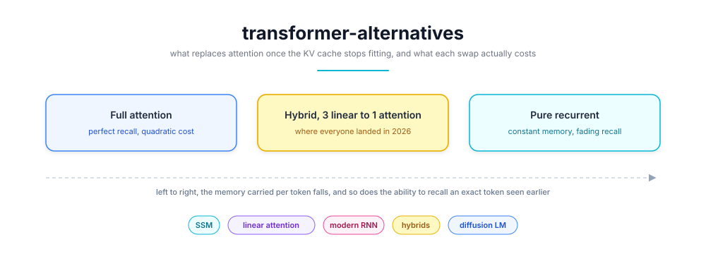
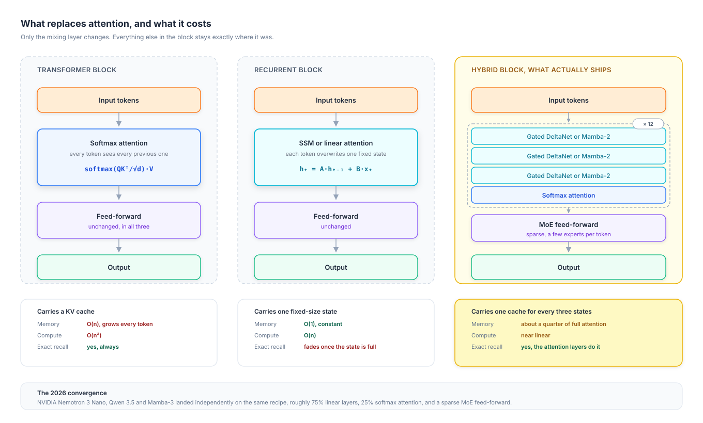
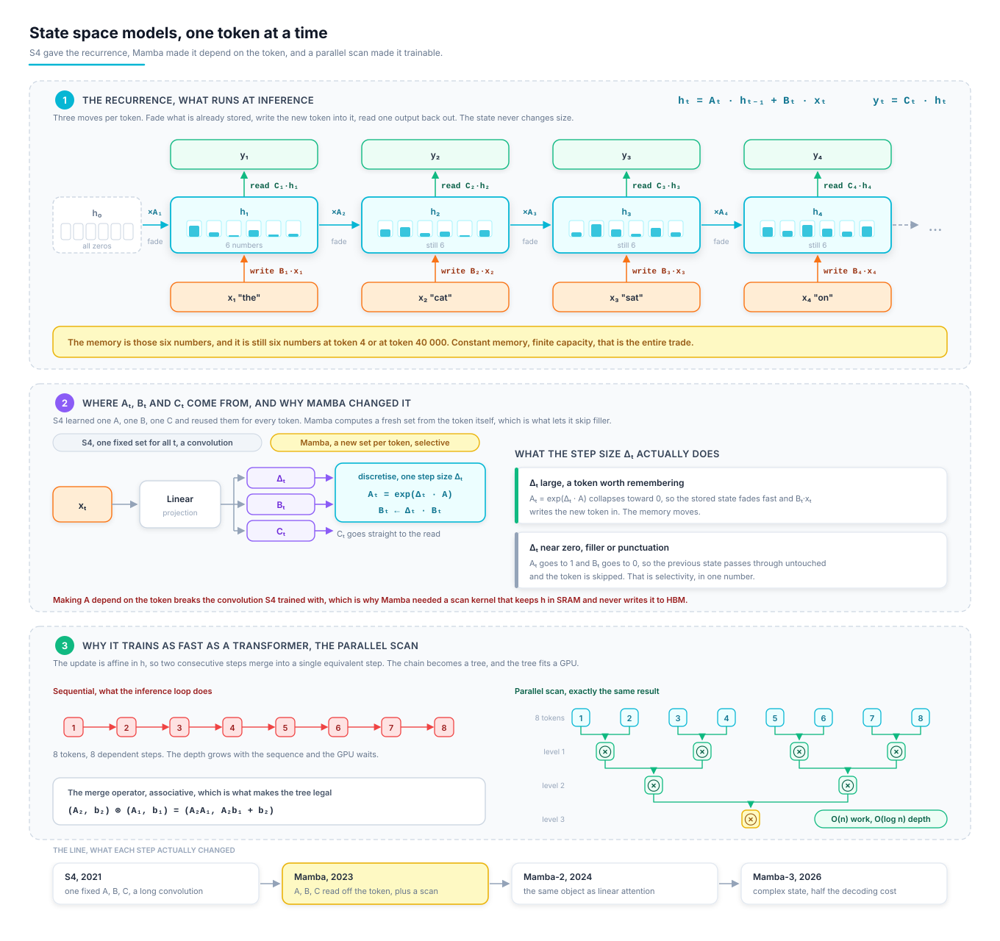
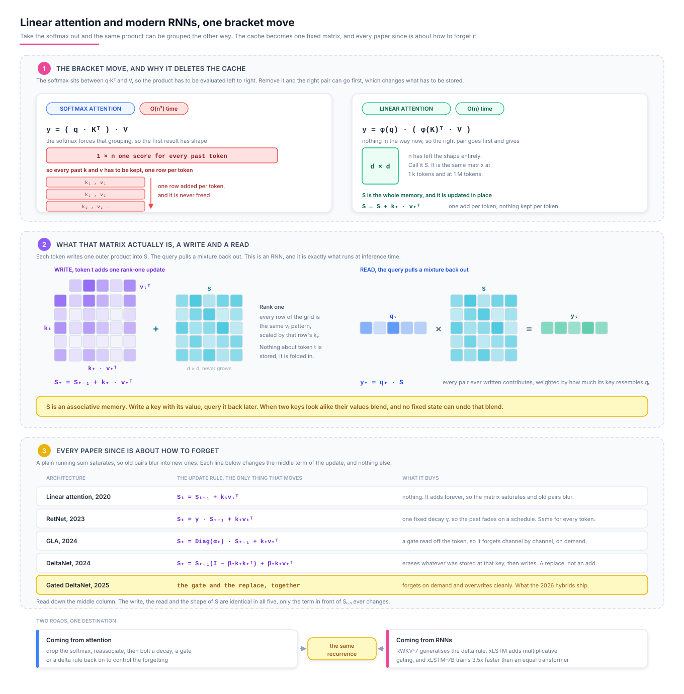
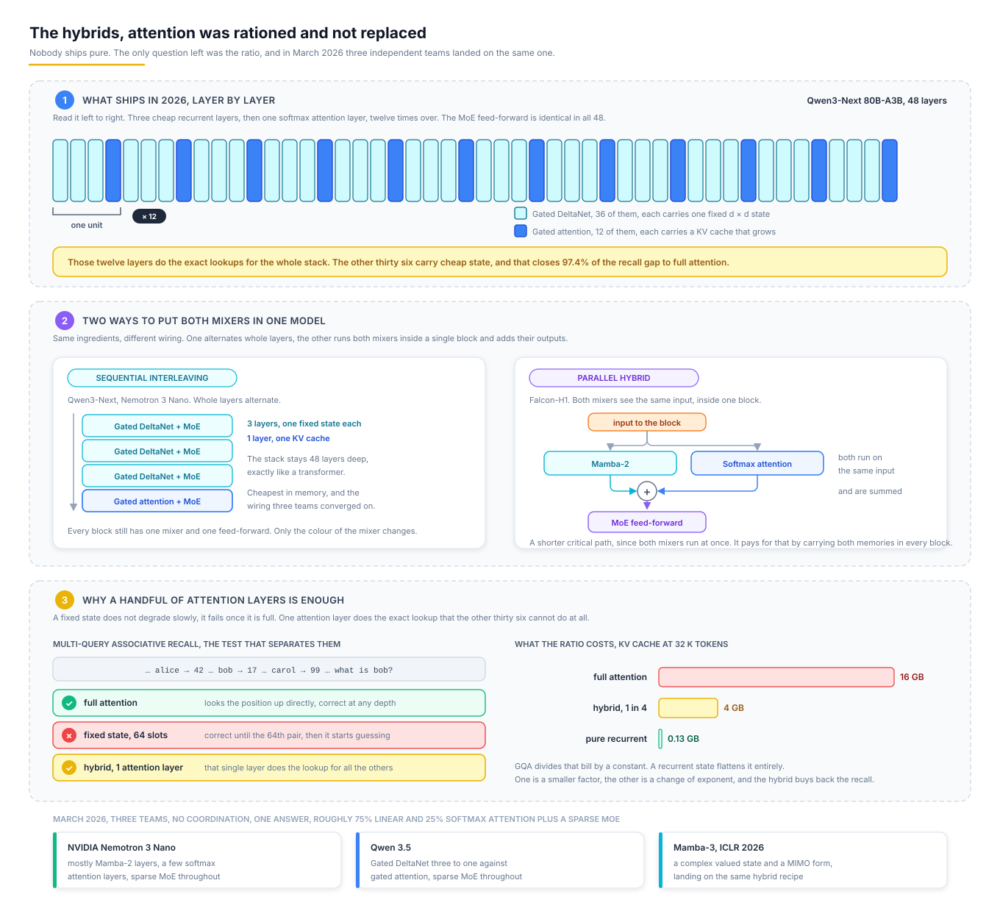
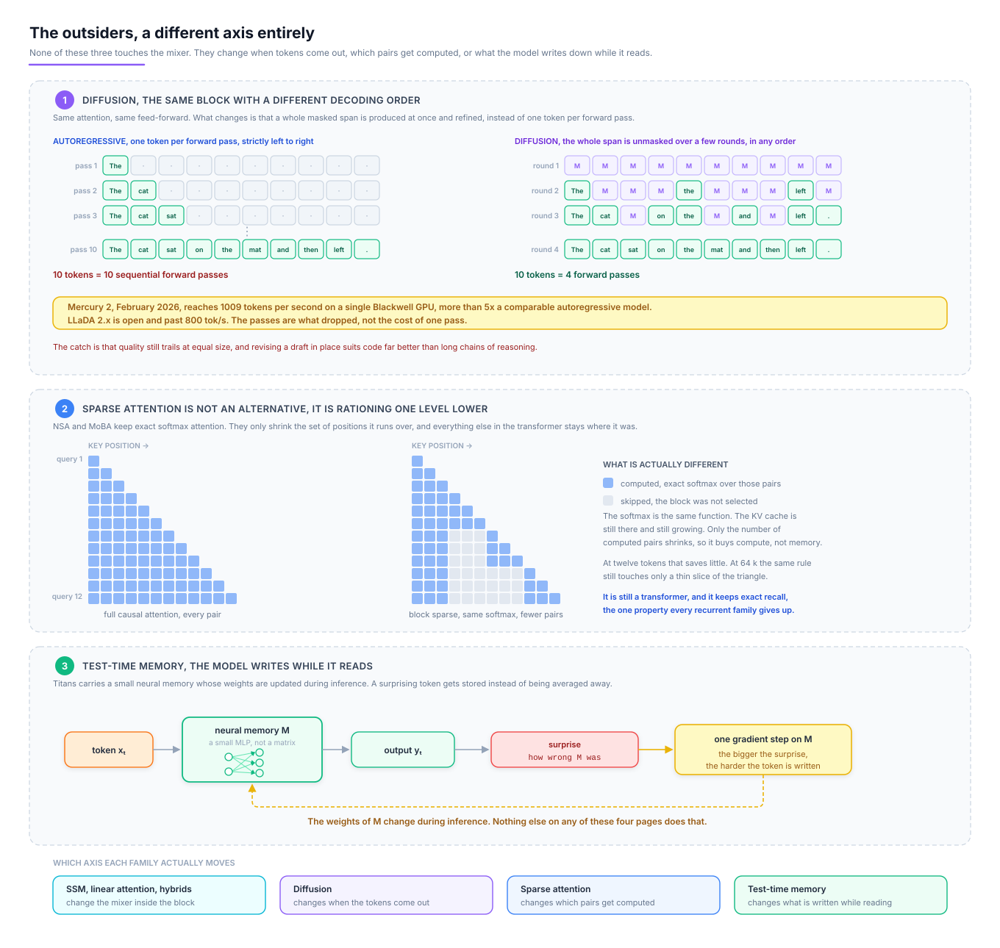

# 🌊 transformer-alternatives


<p align="center">
  
</p>

---

## 📝 Project Description

Attention is not being replaced because it works badly. It is being replaced because **it remembers by keeping everything**. Every token generated adds a row to a KV cache that never shrinks, so memory grows with context and compute grows with its square. That bill, not the quality, is what pushed a whole field to look for something else.

Every alternative here makes the same trade. **Replace a cache that grows with a state that does not**, and accept that a fixed state eventually forgets. This repository documents what each family does with that trade, and what it costs when the state runs out.

It is the third of a series. [Language Models from Scratch](https://github.com/Thibault-GAREL/Language_Models) builds the 2017 Transformer, [modern-transformer](https://github.com/Thibault-GAREL/LLMs_modern_from_scratch) rebuilds everything that changed **inside** it, and this one covers what tries to **replace** it.

🚨 **The documentation is the deliverable right now.** The Python package in "Repository structure" is the plan, not shipped code.

---

## ⚙️ Features

  🌊 **The four families**, state space models, linear attention, modern RNNs, and the outsiders, each with the algebra that makes it work

  💸 **The number that started everything**, what a KV cache actually costs at 32 k tokens on a 6 GB card

  🎯 **The price of a fixed state**, why associative recall is the test that separates these architectures and nothing else does

  🧩 **The hybrids**, the 3:1 ratio three independent teams converged on in March 2026

  🗺️ **Five diagrams**, the block comparison plus one per family, each drawn so the mechanism reads from the picture alone

  🧪 **Provider-agnostic comparisons**, the same block harness with one mixer slot, so families swap without touching anything else

---

## Example Outputs

**The bill.** A 7B model, 32 layers, generating with a growing context. This is the whole reason the field moved.

| Context | Attention, plain MHA | Attention, GQA at 8 kv heads | Mamba-2 state |
|---|---|---|---|
| 1 k tokens | 0.5 GB | 0.13 GB | 0.13 GB |
| 8 k tokens | 4 GB | 1 GB | 0.13 GB |
| 32 k tokens | 16 GB | 4 GB | 0.13 GB |
| 128 k tokens | 64 GB | 16 GB | 0.13 GB |

Read the last column, it never moves. **GQA divides the bill, a recurrent state flattens it.** That difference is the entire argument: one is a constant factor, the other is a change of exponent. On a 6 GB card the practical consequence is blunt, at 32 k tokens the KV cache alone leaves no room for the weights it belongs to.

**The price.** Multi-Query Associative Recall, the benchmark that made the trade-off measurable.

```
prompt   "... alice -> 42 ...  bob -> 17 ...  carol -> 99 ...   what is bob?"

full attention          looks the position up directly, correct at any depth
fixed state, 64 slots   correct until the 64th pair, then it starts guessing
hybrid, 1 attention     correct, that single layer does the lookup for the others
```

**The middle line is the whole story.** A fixed state does not degrade gracefully, it degrades **once it is full**. Everything written after that overwrites something written before, and no amount of training fixes a capacity limit. This is why pure recurrent models look excellent on perplexity and disappoint on "find the one line in this file".

### 📝 Notes & Observations

  📈 **Perplexity hides it.** Averaged over a corpus, forgetting one rare token costs almost nothing. Zoology pinned the number down, **82% of the perplexity gap** between attention-free models and attention comes from recall alone, which is why MQAR became the standard probe.

  ⚖️ **Nobody ships pure.** Every serious 2026 release keeps some softmax attention. The question stopped being *whether* to keep it and became *how little* is enough.

---

## ⚙️ How it works

  🧱 **A block has two halves**, a mixer that moves information between tokens and a feed-forward that transforms each token alone.

  🎯 **Only the mixer ever changes.** Every architecture below swaps that one slot and leaves the rest of the block untouched.

  💾 **Attention mixes by keeping every past token** and looking them all up, which is why it needs a growing cache.

  🌊 **A recurrent mixer folds the past into one fixed tensor**, so it carries a constant amount of memory whatever the context.

  ⚡ **The breakthrough was training, not inference.** A parallel scan computes the same recurrence in `O(log n)` depth, so these models train as fast as transformers instead of sequentially.

  🧩 **Hybrids keep a few attention layers**, which buys back the exact recall the fixed states cannot do.

---

## 🗺️ Architecture Diagram



Three blocks, one difference. The left keeps every token, the middle keeps one state, the right keeps one cache for every three states. The four families below fill in that middle and right column.

---

## 1️⃣ State space models

**A recurrence borrowed from control theory, made trainable in parallel.**



```python
# What runs at inference, one token at a time. h is the entire memory.
for t in range(seq_len):
    h = A[t] * h + B[t] * x[t]
    y[t] = C[t] @ h

# The same maths at training time. This is the breakthrough, not the recurrence.
y = associative_scan(A, B, C, x)   # O(n) work, O(log n) depth on a GPU
```

  🎛️ **S4 came from signal processing**, not from language. A structured state matrix plus a discretisation step turns a continuous system into something that handles 16 k tokens without attention.

  🎯 **Mamba made `A`, `B` and `C` depend on the input.** That selectivity is what lets it skip filler and keep what matters. It broke the convolutional shortcut, so the answer was a hardware-aware scan that never writes the state to HBM.

  🔗 **Mamba-2 proved SSMs and linear attention are the same object** (state space duality), which unlocked plain matmul kernels. **Mamba-3** (ICLR 2026) adds a complex-valued state update for richer state tracking and a MIMO form, matching strong baselines at **half the decoding cost**.

> **Selectivity is the whole idea.** A fixed `A` filters every token the same way, which is a convolution wearing a costume. Making it input-dependent is what turned a nice long-range model into a language model.

---

## 2️⃣ Linear attention and modern RNNs

**Drop the softmax and the algebra reassociates, which is all it takes.**



```
attention          softmax(q · kᵀ) · v          the softmax blocks reassociation, so O(n²)

linear attention   (φ(q) · φ(k)ᵀ) · v
                 = φ(q) · (φ(k)ᵀ · v)           one fixed d × d matrix S, carried forward
                            └─ a running sum, updated per token
```

  🔑 **That one bracket move changes everything.** `kᵀv` becomes a running sum instead of a matrix to rebuild, so the model is an RNN at inference and a parallel scan at training, with no cache in sight.

  🚪 **Everything since is about how to forget.** A plain sum saturates, so RetNet added a fixed exponential decay, GLA a data-dependent gate, and DeltaNet a write rule that **replaces** an association instead of adding to it. Gated DeltaNet combines both and is what most 2026 hybrids actually use.

  🐦 **RWKV and xLSTM arrive from the RNN side** and land in the same place. RWKV-7 generalises the delta rule, and xLSTM-7B trains **3.5x faster** than a transformer of equal size through multiplicative gating.

> **Two roads, one destination.** One camp removed the softmax from attention, the other fixed the RNN so it trains in parallel. They met in the middle, and the modern papers are barely distinguishable.

---

## 3️⃣ The hybrids

**Nobody ships pure. The interesting question is the ratio.**



```
Qwen3-Next 80B-A3B, 48 layers

  ┌ Gated DeltaNet ┐
  │ Gated DeltaNet │  × 12   →   36 linear layers, 12 attention layers
  │ Gated DeltaNet │             MoE feed-forward throughout
  └ Gated attention┘
```

  🧩 **A handful of attention layers buys the recall back.** Those twelve layers do the exact lookups, the other thirty-six carry cheap state. Zoology measured hybrids closing **97.4% of the gap** to full attention while keeping sub-quadratic scaling, and cache memory drops to roughly a quarter.

  🔀 **Two ways to mix.** Sequential interleaving (Qwen3-Next, Nemotron) alternates layers. Parallel hybrids (Falcon-H1) run Mamba-2 and attention **side by side in the same block** and sum them, which trades memory for a shorter critical path.

  🎯 **March 2026 settled it.** NVIDIA Nemotron 3 Nano, Qwen 3.5 and Mamba-3 landed independently on the same recipe, roughly **75% linear, 25% attention, plus a sparse MoE**. Three teams, no coordination, one answer.

> **Attention was not replaced, it was rationed.** The 2026 architecture is a transformer that pays for full attention only where full attention actually earns its cost.

---

## 4️⃣ The outsiders

**Different axis entirely, these change when tokens are produced, not how they mix.**



```
autoregressive   one token per forward pass, left to right     n passes for n tokens
diffusion        a whole masked passage, refined in k rounds   k passes, k far below n
```

  🌫️ **Diffusion language models shipped.** Mercury 2 (February 2026) reaches **1009 tokens per second** on a single Blackwell GPU, over 5x comparable autoregressive models, and LLaDA 2.x is open and past 800 tok/s. The catch is that quality still trails at equal size, and editing a draft in place fits code better than long reasoning.

  🕳️ **Sparse attention is not an alternative.** NSA and MoBA keep exact softmax attention and simply compute it over selected blocks. It is rationing again, one level lower, and it stays inside the transformer.

  🧠 **Test-time memory writes during inference.** Titans keeps a small neural memory updated while it reads, so surprising tokens get stored rather than averaged away. Closer to giving the model a notebook than to changing its mixer.

---

## 🧠 What actually decides, in five lines

  1️⃣ **The cache is the problem**, not the attention. Every alternative is an answer to a memory bill.

  2️⃣ **A fixed state is a capacity, not a compression.** It does not degrade slowly, it fails once full.

  3️⃣ **Parallel training was the unlock.** A recurrence nobody can train in parallel is a research curiosity.

  4️⃣ **Perplexity will not show you the difference.** Retrieval will, which is why MQAR exists.

  5️⃣ **The answer was a ratio.** Keep the attention you need, replace the rest, and that number turned out to be about one in four.

---

## 📂 Repository structure
```bash
├── assets/
│   ├── banner.svg
│   ├── architecture.svg      # three blocks, one difference
│   ├── ssm.svg               # the recurrence, selectivity, the parallel scan
│   ├── linear-attention.svg  # the bracket move, the matrix S, the write rules
│   ├── hybrids.svg           # the 3:1 stack, both wirings, what it buys
│   └── outsiders.svg         # diffusion, block sparse attention, test-time memory
│
├── scripts/
│   └── md_to_pdf.py          # renders this README to PDF via headless Edge
│
├── src/alt/                  # 🚨 planned, not written yet
│   ├── block.py              # one block, one swappable mixer slot
│   ├── hybrid.py             # the interleaving pattern and its ratio
│   │
│   ├── mixers/
│   │   ├── attention.py      # the baseline, MHA and GQA
│   │   ├── ssm.py            # S4, Mamba, Mamba-2, associative scan
│   │   ├── linear.py         # linear attention, RetNet decay, GLA gating
│   │   ├── deltanet.py       # the delta write rule, gated variant
│   │   └── rnn.py            # RWKV and xLSTM style gating
│   │
│   └── bench/
│       ├── kv_memory.py      # the table at the top of this README
│       ├── mqar.py           # associative recall, the test that matters
│       └── throughput.py     # tokens per second against context length
│
├── LICENSE
├── README.md
```

---

## 💻 Run it on Your PC

🚨 **There is nothing to run yet.** The README is the current state, the package is the plan. Cloning still helps, the five diagrams read better locally than on GitHub (the `Inter` import is blocked by GitHub's sandbox).

```bash
git clone https://github.com/Thibault-GAREL/Transformer_alternative.git
cd Transformer_alternative

python scripts/md_to_pdf.py     # regenerate README.pdf after any edit
```

Once `src/alt/` exists, the intended setup is below.

```bash
python -m venv .venv # if you don't have a virtual environment
source .venv/bin/activate   # Linux / macOS
.venv\Scripts\activate      # Windows

pip install torch pydantic pyyaml rich

python -m alt.bench.mqar --mixer ssm --state 64      # where a fixed state breaks
python -m alt.bench.kv_memory --context 32768        # the bill, measured
```

⚠️ The scan kernels of Mamba and friends want a **CUDA-compatible GPU**. On 6 GB of VRAM the ablation sizes fit comfortably, since the point here is comparing mixers at small scale rather than training something large.

---

## 📖 Inspiration / Sources

This project is a study, so the sources matter more than usual:

- 📄 [Mamba, Linear-Time Sequence Modeling with Selective State Spaces](https://arxiv.org/abs/2312.00752) (Gu and Dao, 2023)
- 📄 [Transformers are SSMs, state space duality](https://arxiv.org/abs/2405.21060) (Dao and Gu, 2024), the paper that unified the two camps
- 📄 [Mamba-3, Improved Sequence Modeling using State Space Principles](https://arxiv.org/abs/2603.15569) (ICLR 2026)
- 📄 [Simple linear attention language models balance the recall-throughput tradeoff](https://arxiv.org/abs/2402.18668) (Arora et al., 2024), where MQAR comes from
- 📄 [xLSTM, Extended Long Short-Term Memory](https://arxiv.org/abs/2405.04517) (Beck et al., 2024)
- 📄 [RWKV, Reinventing RNNs for the Transformer Era](https://arxiv.org/abs/2305.13048) (Peng et al., 2023)
- 📄 [Zoology, Measuring and Improving Recall in Efficient Language Models](https://arxiv.org/abs/2312.04927) (Arora et al., 2023), the analysis that made the recall gap measurable
- 🧬 [modern-transformer](https://github.com/Thibault-GAREL/LLMs_modern_from_scratch) (my own model, everything that changed inside the block)
- 🔁 [llm-harness](https://github.com/Thibault-GAREL/LLM_harness) (my own study of the agent loop that runs a trained model)

Code created by me 😎, Thibault GAREL - [Github](https://github.com/Thibault-GAREL)
